# Talabat Backend Clone

A comprehensive microservices-based food delivery platform backend built with Spring Boot, following modern distributed system principles and containerization best practices.

## � Table of Contents

- [🚀 Tech Stack](#-tech-stack)
- [✨ Features](#-features)
- [🗄️ Database Schema](#️-database-schema)
- [🔗 REST API Endpoints](#-rest-api-endpoints)
- [🛠️ Setup Instructions](#️-setup-instructions)
- [📖 API Usage Examples](#-api-usage-examples)
- [📁 Project Structure](#-project-structure)
- [🤝 Contributing](#-contributing)
- [📄 License](#-license)
- [👥 Team](#-team)

## 🚀 Tech Stack

<p align="center">
  
  
  
  
  
  
  
  
  
  
  
</p>

### 🏗️ Architecture & Framework
- **Backend Framework**:  
- **Microservices Communication**: OpenFeign, RabbitMQ
- **API Gateway**: Spring Cloud Gateway
- **Security**:  Authentication, Spring Security

### 🗄️ Databases
- **PostgreSQL**:  (AuthService, OrderService)
- **MongoDB**:  (ProductService, CartService) 
- **Apache Cassandra**:  (ChatService)
- **Caching**: 

### 🚀 DevOps & Deployment
- **Containerization**:  
- **Orchestration**: 
- **Message Queue**: 

### 🛠️ Development Tools
- **IDEs**:  
- **API Testing**: 
- **Build Tool**: 

## ✨ Features

<div align="center">
  
  
  
  
</div>

<br>

### 🏢 Core Services
- **🔐 Authentication Service**: User registration, login, JWT token management, email verification, password reset
- **📦 Product Service**: Product catalog management, CRUD operations, search functionality
- **🛒 Cart Service**: Shopping cart management, item addition/removal, cart persistence
- **📋 Order Service**: Order processing, status tracking, order history
- **💬 Chat Service**: Real-time messaging system with message status tracking
- **🌐 API Gateway**: Centralized routing, authentication, and load balancing

### 🎯 Key Features
- **🏗️ Microservices Architecture**: Loosely coupled, independently deployable services
- **🔒 JWT Authentication**: Secure token-based authentication across all services
- **⚡ Real-time Communication**: Message queue integration with RabbitMQ
- **🚀 Caching Strategy**: Redis-based caching for improved performance
- **🗄️ Database Per Service**: Each service manages its own database
- **🐳 Containerized Deployment**: Docker containers with Kubernetes orchestration
- **🔍 Service Discovery**: Inter-service communication via OpenFeign clients

## 🏗️ Architecture Overview

```mermaid
graph TB
    Client[👥 Client Applications] --> Gateway[🌐 API Gateway :8080]
    
    Gateway --> Auth[🔐 Auth Service :8081]
    Gateway --> Product[📦 Product Service :8085]
    Gateway --> Cart[🛒 Cart Service :8082]
    Gateway --> Order[📋 Order Service :8084]
    Gateway --> Chat[💬 Chat Service :8083]
    
    Auth --> PostgresAuth[(🐘 PostgreSQL<br>Auth DB)]
    Auth --> RedisCache[(🔴 Redis Cache)]
    
    Product --> MongoDB1[(🍃 MongoDB<br>Products DB)]
    Cart --> MongoDB2[(🍃 MongoDB<br>Cart DB)]
    Cart --> RedisCache
    
    Order --> PostgresOrder[(🐘 PostgreSQL<br>Orders DB)]
    Chat --> Cassandra[(🔷 Cassandra<br>Messages DB)]
    
    Order --> RabbitMQ[🐰 RabbitMQ]
    Cart --> RabbitMQ
    Product --> RabbitMQ
    
    style Gateway fill:#e1f5fe
    style Auth fill:#f3e5f5
    style Product fill:#e8f5e8
    style Cart fill:#fff3e0
    style Order fill:#fce4ec
    style Chat fill:#f1f8e9
```



## 🗄️ Database Schema

<div align="center">
  
  
  
</div>

<br>

### 🐘 AuthService (PostgreSQL)
```sql
-- Users table
CREATE TABLE users (
    id UUID PRIMARY KEY,
    username VARCHAR(255),
    password VARCHAR(255),
    email VARCHAR(255) UNIQUE,
    address VARCHAR(255),
    phone_number VARCHAR(20),
    role VARCHAR(50)
);
```

### 🍃 ProductService (MongoDB)
```javascript
// Products collection
{
  _id: ObjectId,
  id: UUID,
  name: String,
  sellerId: UUID,
  price: Double,
  amountSold: Number,
  description: String,
  discount: Double,
  type: String // "Food" or "Beverage"
}
```

### 🍃 CartService (MongoDB)
```javascript
// Carts collection
{
  _id: ObjectId,
  id: UUID,
  customerId: UUID,
  cartItems: [
    {
      productId: UUID,
      quantity: Number,
      notes: String
    }
  ],
  notes: String,
  promo: Boolean
}
```

### 🐘 OrderService (PostgreSQL)
```sql
-- Orders table
CREATE TABLE orders (
    id UUID PRIMARY KEY,
    buyer_id UUID,
    status VARCHAR(50),
    order_date TIMESTAMP,
    total_price DECIMAL(10,2),
    order_note TEXT
);

-- Order Items table
CREATE TABLE order_items (
    id UUID PRIMARY KEY,
    order_id UUID REFERENCES orders(id),
    product_id UUID,
    quantity INTEGER,
    price DECIMAL(10,2),
    notes TEXT
);
```

### 🔷 ChatService (Cassandra)
```cql
-- Messages table
CREATE TABLE messages (
    id UUID PRIMARY KEY,
    sender_id UUID,
    receiver_id UUID,
    content TEXT,
    type TEXT,
    status TEXT,
    timestamp TIMESTAMP,
    report_type TEXT
);
```

## 🔗 REST API Endpoints

<div align="center">
  
  
  
</div>

<br>

### 🔠AuthService 
```
POST   /auth/register          # User registration
POST   /auth/token            # User login
GET    /auth/validate-token   # Token validation
GET    /auth/verify-email     # Email verification
PUT    /auth/reset-password   # Password reset request
PUT    /auth/update-password  # Password update
DELETE /auth/delete-account/{userId} # Account deletion
POST   /auth/fetch-emails     # Fetch user emails by IDs
```

### 📦 ProductService 
```
GET    /products              # Get all products
POST   /products              # Create product
GET    /products/{id}         # Get product by ID
PUT    /products/{id}         # Update product
DELETE /products/{id}         # Delete product
POST   /products/ids          # Get products by multiple IDs
GET    /products/most-sold    # Get most sold products
PUT    /products/discount/{id} # Apply discount
PUT    /products/{id}/decrement # Decrement amount sold
```

### 🛒 CartService 
```
POST   /carts/createCart                    # Create cart
PUT    /carts/addProduct                   # Add product to cart
GET    /carts/getCart                      # Get user cart
PUT    /carts/{productId}/addNotesToCartItem # Add notes to cart item
PUT    /carts/{productId}/removeProduct    # Remove product from cart
PUT    /carts/updatePromo                  # Update promo status
PUT    /carts/updateNotes                  # Update cart notes
DELETE /carts                             # Delete cart
POST   /carts/checkout                     # Checkout cart
POST   /carts/reorder                      # Reorder from previous order
```

### 📋 OrderService 
```
GET    /orders                    # Get all orders
POST   /orders                    # Create order
GET    /orders/buyer/{buyerId}    # Get orders by buyer ID
GET    /orders/seller             # Get orders by seller ID
GET    /orders/{orderId}          # Get order by ID
PUT    /orders/{orderId}/newState # Update order status
PUT    /orders/{orderId}/items/{productId}/editNote # Edit order item note
POST   /orders/{orderId}/reorder  # Reorder
```

### 💬 ChatService 
```
GET    /messages                  # Get all messages (paginated)
POST   /messages                  # Create message
GET    /messages/{id}            # Get message by ID
PATCH  /messages/{id}            # Update message
PATCH  /messages/{id}/seen       # Mark message as seen
GET    /messages/{id}/seen       # Get message seen status
GET    /messages/search          # Search messages
PATCH  /messages/report/{id}     # Report message
DELETE /messages                 # Clear all messages
GET    /messages/seed            # Seed test messages
```

### 🌠API Gateway 
```
# Routes all requests to appropriate microservices
/auth/**     -> AuthService
/carts/**    -> CartService  
/orders/**   -> OrderService
/messages/** -> ChatService
/products/** -> ProductService
```

## 🛠️ Setup Instructions

<div align="center">
  
  
  
  
</div>

<br>

### 📋 Prerequisites
- 
- 
-  & Docker Compose
-  (optional)

### 🚀 Local Development Setup

1. **Clone the repository**
   ```bash
   git clone https://github.com/M-Bahy/Talabat-Backend-Clone.git
   cd Talabat-Backend-Clone
   ```

2. **Start infrastructure services**
   ```bash
   cd Microservices
   docker-compose up -d postgres_db redis_cache
   ```

3. **Start databases individually (alternative)**
   ```bash
   # PostgreSQL
   docker run -d --name postgres -p 5432:5432 -e POSTGRES_PASSWORD=1234 -e POSTGRES_DB=auth_db postgres
   
   # MongoDB
   docker run -d --name mongodb -p 27017:27017 -e MONGO_INITDB_ROOT_USERNAME=root -e MONGO_INITDB_ROOT_PASSWORD=example mongo
   
   # Cassandra
   docker run -d --name cassandra -p 9042:9042 cassandra:latest
   
   # Redis
   docker run -d --name redis -p 6379:6379 redis:latest
   
   # RabbitMQ
   docker run -d --name rabbitmq -p 5672:5672 -p 15672:15672 rabbitmq:management
   ```

4. **Build and run services**
   ```bash
   # Build all services
   mvn clean install
   
   # Run services individually
   cd AuthService && mvn spring-boot:run &
   cd ../ProductService && mvn spring-boot:run &
   cd ../CartService && mvn spring-boot:run &
   cd ../OrderService && mvn spring-boot:run &
   cd ../ChatService && mvn spring-boot:run &
   cd ../API-Gateway && mvn spring-boot:run &
   ```

### 🐳 Docker Deployment

1. **Build and run all services**
   ```bash
   cd Microservices
   docker-compose up --build
   ```

2. **Access services**
   - API Gateway: http://localhost:8080
   - Individual services accessible through gateway or direct ports

### ☸️ Kubernetes Deployment

1. **Apply namespace and secrets**
   ```bash
   kubectl apply -f k8s/namespace.yaml
   kubectl apply -f k8s/secrets/
   ```

2. **Deploy infrastructure**
   ```bash
   kubectl apply -f k8s/rabbitmq/
   kubectl apply -f k8s/cassandra/
   ```

3. **Deploy services**
   ```bash
   kubectl apply -f k8s/auth/
   kubectl apply -f k8s/product/
   kubectl apply -f k8s/cart/
   kubectl apply -f k8s/order/
   kubectl apply -f k8s/chat/
   kubectl apply -f k8s/api-gateway/
   ```

## 📖 API Usage Examples

### User Registration and Authentication
```bash
# Register a new user
curl -X POST http://localhost:8080/auth/register \
  -H "Content-Type: application/json" \
  -d '{
    "username": "john_doe",
    "email": "john@example.com",
    "password": "password123",
    "address": "123 Main St",
    "phoneNumber": "+1234567890",
    "role": "customer"
  }'

# Login and get JWT token
curl -X POST http://localhost:8080/auth/token \
  -H "Content-Type: application/json" \
  -d '{
    "email": "john@example.com",
    "password": "password123"
  }'
```

### Product Management
```bash
# Create a product (requires seller token)
curl -X POST http://localhost:8080/products \
  -H "Content-Type: application/json" \
  -H "Authorization: Bearer YOUR_JWT_TOKEN" \
  -d '{
    "type": "Food",
    "name": "Margherita Pizza",
    "price": 12.99,
    "amountSold": 0,
    "description": "Classic pizza with tomato sauce and mozzarella",
    "discount": 0.0
  }'

# Get all products
curl -X GET http://localhost:8080/products
```

### Cart Operations
```bash
# Create cart
curl -X POST http://localhost:8080/carts/createCart \
  -H "Authorization: Bearer YOUR_JWT_TOKEN"

# Add product to cart
curl -X PUT http://localhost:8080/carts/addProduct \
  -H "Content-Type: application/json" \
  -H "Authorization: Bearer YOUR_JWT_TOKEN" \
  -d '{
    "productID": "product-uuid-here",
    "quantity": 2,
    "notes": "Extra cheese please"
  }'

# Get cart
curl -X GET http://localhost:8080/carts/getCart \
  -H "Authorization: Bearer YOUR_JWT_TOKEN"
```

### Order Processing
```bash
# Create order
curl -X POST http://localhost:8080/orders \
  -H "Content-Type: application/json" \
  -H "Authorization: Bearer YOUR_JWT_TOKEN" \
  -d '{
    "items": [
      {
        "productId": "product-uuid",
        "quantity": 2,
        "price": 12.99
      }
    ],
    "totalPrice": 25.98
  }'

# Get user orders
curl -X GET http://localhost:8080/orders/buyer/user-id \
  -H "Authorization: Bearer YOUR_JWT_TOKEN"
```

### Chat Messaging
```bash
# Send message
curl -X POST http://localhost:8080/messages \
  -H "Content-Type: application/json" \
  -H "Authorization: Bearer YOUR_JWT_TOKEN" \
  -d '{
    "receiverId": "receiver-uuid",
    "content": "Hello, is the order ready?",
    "type": "TEXT"
  }'

# Get messages
curl -X GET http://localhost:8080/messages \
  -H "Authorization: Bearer YOUR_JWT_TOKEN"
```

## 📁 Project Structure

```
Talabat-Backend-Clone/
├── Microservices/
│   ├── API-Gateway/              # Spring Cloud Gateway
│   │   ├── src/main/java/
│   │   └── src/main/resources/
│   ├── AuthService/              # Authentication & User Management
│   │   ├── src/main/java/
│   │   └── src/main/resources/
│   ├── ProductService/           # Product Catalog Management
│   │   ├── src/main/java/
│   │   └── src/main/resources/
│   ├── CartService/              # Shopping Cart Management
│   │   ├── src/main/java/
│   │   └── src/main/resources/
│   ├── OrderService/             # Order Processing
│   │   ├── src/main/java/
│   │   └── src/main/resources/
│   ├── ChatService/              # Messaging System
│   │   ├── src/main/java/
│   │   └── src/main/resources/
│   ├── k8s/                      # Kubernetes Deployments
│   │   ├── auth/
│   │   ├── product/
│   │   ├── cart/
│   │   ├── order/
│   │   ├── chat/
│   │   ├── api-gateway/
│   │   ├── cassandra/
│   │   ├── rabbitmq/
│   │   └── secrets/
│   ├── docker-compose.yaml       # Docker Compose Configuration
│   └── pom.xml                   # Parent POM
├── Task2/                        # Additional Tasks
└── README.md
```

## 🤝 Contributing

<div align="center">
  
  
</div>

<br>

1. 🍴 Fork the repository
2. 🌿 Create a feature branch (`git checkout -b feature/amazing-feature`)
3. 💾 Commit your changes (`git commit -m 'Add some amazing feature'`)
4. 📤 Push to the branch (`git push origin feature/amazing-feature`)
5. 🔀 Open a Pull Request

## 📄 License

This project is licensed under the MIT License - see the LICENSE file for details.

## 👥 Team

<div align="center">
  
</div>

<br>

This project was developed as part of a microservices learning initiative, implementing modern backend development practices and distributed system principles.

---

<div align="center">
  <h3>🔗 Connect With The Project</h3>
  
  [](https://github.com/M-Bahy/Talabat-Backend-Clone)
  [](https://github.com/M-Bahy/Talabat-Backend-Clone)
  [](https://github.com/M-Bahy/Talabat-Backend-Clone)
  
  <br><br>
  
  **⭐ Star this repository if it helped you!**
  
  
  
  
</div>